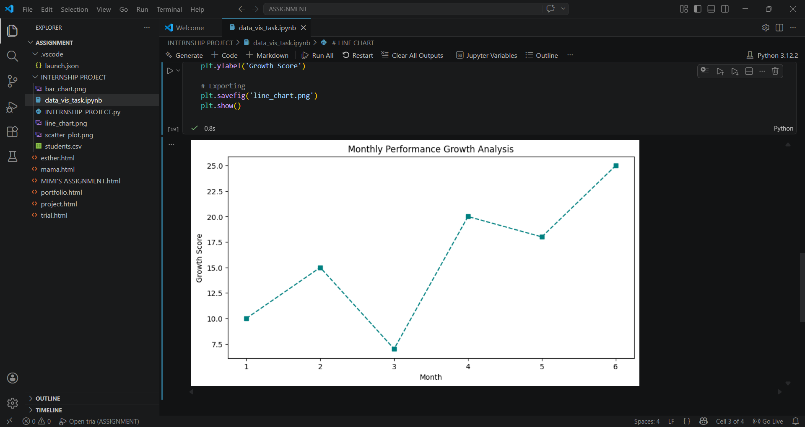

# Internship Project: Basic Data Visualisation

This project focuses on Basic Data Visualisation using Python, Matplotlib, and Seaborn. 

## Objectives
* Create bar plots, line charts, and scatter plots.
* Customise plot labels, titles, and legends for readability.
* Export plots as images for professional reporting.

## Technologies Used
* **Python**
* **Pandas** (Data Manipulation)
* **Matplotlib & Seaborn** (Visualisation)

## Visuals

